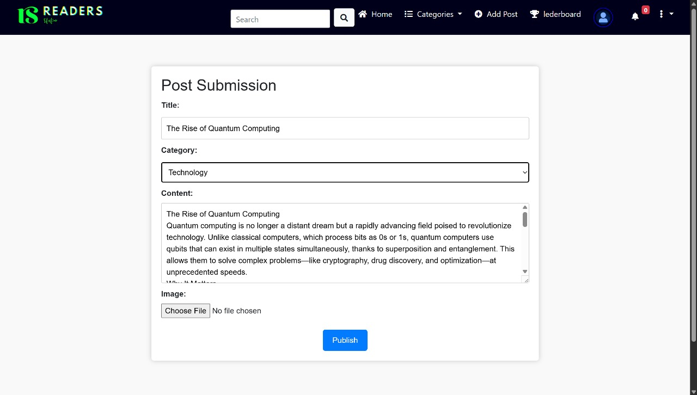

# ReadersStation
# Project is live at [https://readersstation.onrender.com/](https://readersstation.onrender.com/)

**ReadersStation** is a Django-powered social blogging platform where users can publish posts, follow other contributors, bookmark favorite content, and explore trending feeds by category. It features authentication, user profiles, rich post management, search and filter capabilities, and an intuitive UI optimized with WhiteNoise for static assets.


**GitHub Repository:** [https://github.com/GaneshNeupane01/ReadersStation.git]()



---

## Features

- User registration, login, and profile management
- Create, read, update, and delete (CRUD) posts
- Image uploads via Cloudinary
- Follow and bookmark other users and posts ,commenting on posts ,leaderboard
- Topic-based search and trending feeds
- Responsive design with Bootstrap
- Optimized static asset delivery with WhiteNoise

---

## Tech Stack

- **Backend:** Python, Django 5.0.4
- **Database:** SQLite
- **Deployment:** Gunicorn, WhiteNoise
- **Frontend:** HTML5, CSS3, Bootstrap
- **Media Storage:** Cloudinary
- **Version Control:** Git, GitHub

---

## Prerequisites

- Python 3.11+
- pip
- virtualenv
- Docker & Docker Compose (optional for containerized setup)
- Cloudinary account (for media storage)

---

## Getting Started (Local Development)

### 1. Clone the Repository

```bash
git clone https://github.com/GaneshNeupane01/ReadersStation.git
cd ReadersStation
````

### 2. Create & Activate Virtual Environment

```bash
python -m venv venv
# Linux/macOS
source venv/bin/activate
# Windows
venv\Scripts\activate
```

### 3. Install Dependencies

```bash
pip install -r requirements.txt
```

### 4. Configure Environment Variables

Create a `.env` file in the project root (or set environment variables) with your Cloudinary credentials:

```env
CLOUDINARY_CLOUD_NAME=your_cloud_name
CLOUDINARY_API_KEY=your_api_key
CLOUDINARY_API_SECRET=your_api_secret
```

Update `settings.py` to load these variables (using `os.environ`).

### 5. Apply Migrations

```bash
python manage.py migrate
```

### 6. Create Superuser (Optional)

```bash
python manage.py createsuperuser
```

### 7. Run the Development Server

```bash
python manage.py runserver
```

Visit `http://127.0.0.1:8000/` to see the app.

---

## Running with Docker

### 1. Build Docker Image

```bash
docker build -t readersstation .
```

### 2. Run Container

Provide Cloudinary credentials via environment variables:

```bash
docker run -d -p 8000:8000 \
-e CLOUDINARY_CLOUD_NAME=your_cloud_name \
-e CLOUDINARY_API_KEY=your_api_key \
-e CLOUDINARY_API_SECRET=your_api_secret \
readersstation
```

The app will be available at `http://localhost:8000/`.

---

## Cloudinary Integration

* All media files (user profile images, post images) are stored in Cloudinary.
* In models, images use:

```python
from cloudinary_storage.storage import MediaCloudinaryStorage

image = models.ImageField(
    upload_to='Blog/profile_images/',
    null=True,
    blank=True,
    storage=MediaCloudinaryStorage()
)
```

* Ensure your Cloudinary credentials are set as environment variables for both local and Docker setups.

---

## Project Structure (Simplified)

```
readersstation/
├─ manage.py
├─ readersstation/
│  ├─ settings.py
│  ├─ urls.py
│  └─ wsgi.py
├─ Blog/
│  ├─ models.py
│  ├─ views.py
│  └─ templates/
├─ static/
├─ media/
└─ requirements.txt
└─ Dockerfile
```


## Contact

Email: [ganeshneupane1357@gmail.com](mailto:ganeshneupane1357@gmail.com)
Portfolio: [https://ganesh-neupane.com.np](https://ganesh-neupane.com.np)


